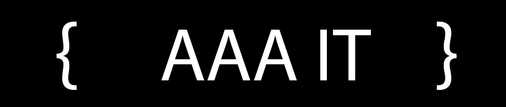
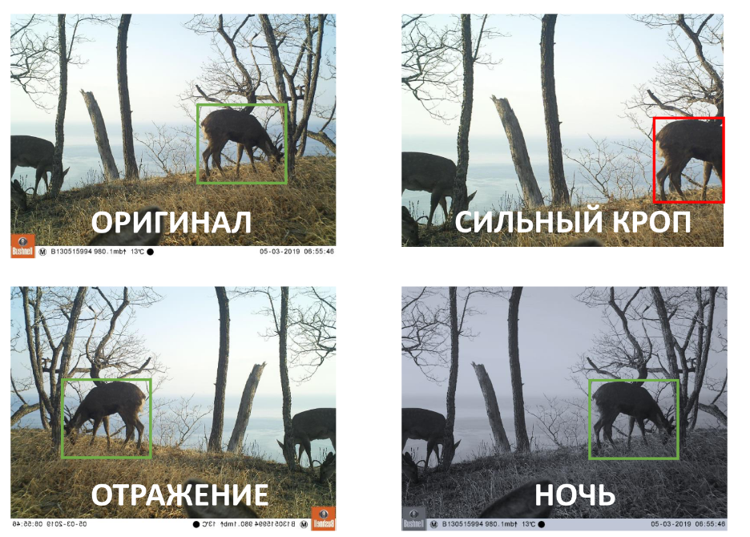
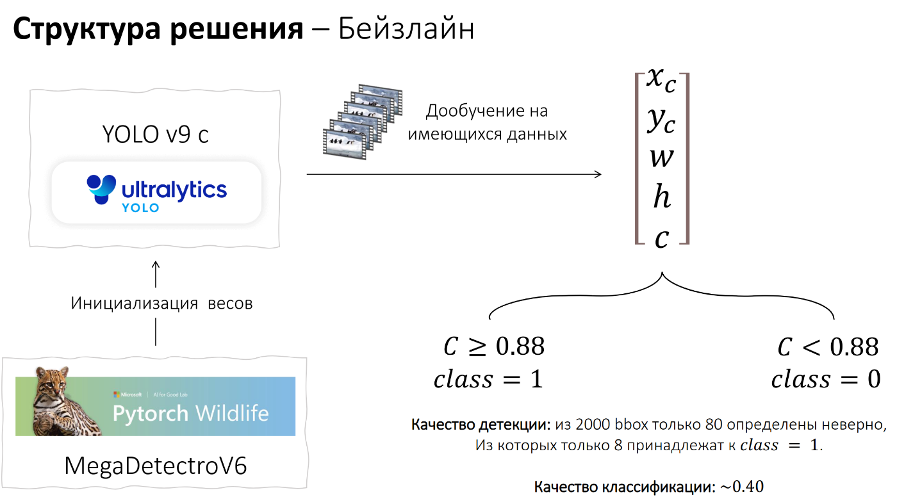
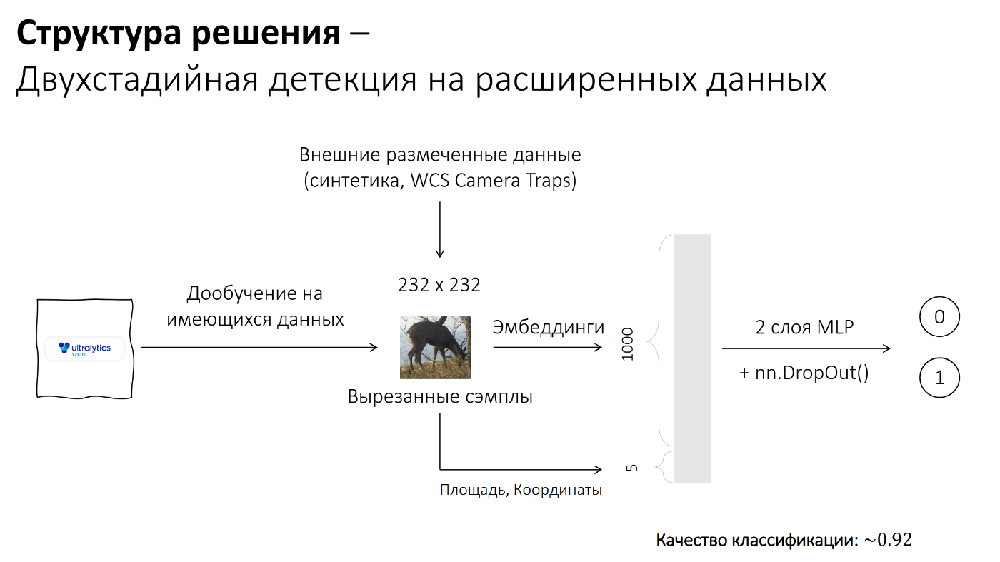
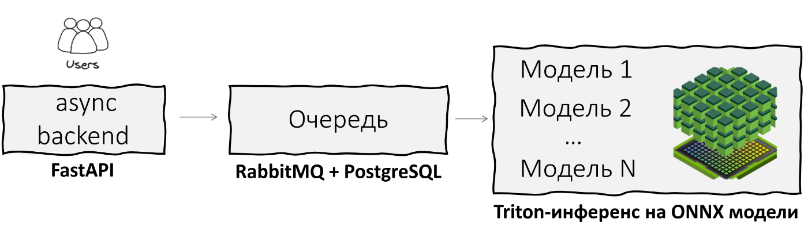

# Animals Detection Hackaton — Autumn 2024

## Основная информация

### Пример развернутого решения (на CPU): http://86.104.74.159

Решение осеннего хакатона 2024. Детекция животных на изображениях.

Система состоит из 2 частей: \
— Этап детекции с качеством, близким к 100% \
— Этап классификации изображений на «вспомогательные» и «основные»  с качеством выше 90% на валидации.

Сервис работает локально и не требует интернет-соединения. \
При этом он также может быть развернут на локальном сервере и распределен между научной группой исследователей.

Может быть развернут как на GPU, так и на стандартных устройствах только с CPU.

## Подход к решению задачи

### Данные

Организаторы предоставили следующие данные: \
— Около 1900 bbox с разметкой классов \
— Около 1500 изображений без животных

На наш взгляд, для обучения серьезной модели детекции и классификации этих данных было бы достаточно мало, 
поэтому решено расширить датасет двумя способами:

1. Использование аугментаций:

Мы использовали как простые аугментации (отражение, контрастность), так и более жесткие кропы для генерации негативных семплов.
Например, таким образом, чтобы животное попало за рамки кадра и стало относиться к вспомогательным изображениям.



2. Использование внешних данных:

Было решено прибегнуть к отрытым датасетам со схожим доменом. Один из таких — WCS Camera Traps, который содержит более 300 000 изображений и около 400 000 bbox.
Из них было отобрано и вручную размечено около 1000 изображений, которые использовались при обучении классификатора.

Reference: [WCS Camera Traps Dataset](https://lila.science/datasets/wcscameratraps)

### Модель

В качестве бейзлайн-модели мы использовали YOLO-v9c. Начальные веса были инициализированы через модель MegaDetectroV6, которая
обучалась на детекцию животных. После этого, модель дополнительно дообучалась на нашем датасете.



Бейзлайн-модель показала близкое к 100% качество детекции и около 0.40 по классификации, что было ожидаемо, ведь
задача детекции уже давно решена на высоком уровне сильными моделями.



Мы решили развить бейзлайн в сторону классификации, так как уклон в метрике был именно на нее.
Для этого мы выделяли сэмплы животных после детекции и вытаскивали эмбеддинги через ResNet и конкатенировали их с площадью и координатами этого сэмпла.
Далее модель дообучалась на 2 слоях MLP с применением регуляризации.

Такая финальная модель получила качество классификации около 0.92 по метрике задачи.

### Архитектура



Архитектура проекта нацелена на масштабируемость. Для этого реализованы:

1. База данных для асинхронно поступающих запросов с сохранением в БД Postgres:

Это позволяет принимать запросы сразу нескольких пользователей в рамках локальной сети и не терять информацию в случае сбоев.

2. Очередь запросов через RabbitMQ:

Это позволяет выдерживать увеличенную нагрузку и гарантировать сохранность данных.

3. Triton-инференс ML-моделей:

Это позволяет параллельно и с высокой скоростью обрабатывать большие запросы поступающих изображенний от нескольких людей в локальной сети.

4. Веб-интерфейс, позволяющий получать полноценный отчет по изображениям и статистике классификации, 
формировать PDF-отчет и визуализировать прогнозы.


## Техническая информация 

### Системные требования

1. **OS `Linux`** (протестировано на `Ubuntu 22.04.3 LTS`).
2. Наличие `Docker-Compose`.


## Быстрый старт

### 0. Скачивание весов модели и `.env` файлов:
```bash
make load-weights
make copy-env-files
```

### 1. Сборка проекта через Docker-Compose:
```bash
docker compose up --build
```

Собираются основные контейнеры: бэкенд, фронтенд, тритон-сервер и прочее.
Это занимает некоторое время, но только в первый раз.

Стоит отметить, что в зависимости от мощностей используемой машины 
необходима юстировка параметра retries в 27 строке файла docker-compose.yaml - 
он отвечает за количество попыток healthcheck'ов
контейнера с основными api.

Это необходимо для корректной работы сервиса nginx'a.


### 2. Остановка контейнеров:

```bash
docker-compose down
```


### 3. Прочее

<details>
  <summary>Команды для локальной разработки</summary>

1. Локальная сборка проекта
   ```bash
   make setup
   ```
2. Запуск тестирования
    ```bash
    make tests
    ```
3. Запуск линтера кода
    ```bash
    make lint
    ```
   
4. Справочная информация по всем командам
    ```bash
    make help
    ```
</details>

<details>
<summary>Дополнительные технические утилиты</summary>
 
- localhost как пример адреса 

Swagger:
```bash
http://localhost:8001/swagger
```

Сбор метрик:
```bash
http://localhost:8081
```

Менеджер контейнеров Portainer:
```bash
https://localhost:9443
```
</details>

<details>
  <summary>Структура проекта</summary>

```linux
.
├── animals          <--- Основной код
│   ├── backend      <--- Бекенд
│   ├── triton       <--- Тритон инференс
│   └── frontend     <--- Фронтенд
├── data             <--- Используемые данные
├── docker           <--- Докер-файлы
├── docs             <--- Документация
├── notebooks        <--- Тестирование гипотез, ноутбуки
└── tests            <--- Тесты
```
</details>
<details>
  <summary>Структура бэкенда</summary>

```linux
backend
├── consumer    <--- Модуль, забирающий задачи из очереди и обрабатывающий их    
└── web         <--- Модуль основных api, кладет задачи в очередь и забирает 
                     результаты работы из бд

Очередь реализована через брокер RabbitMQ
Вид БД  - Postgress

В конечном итоге структура бэкенда:

1. Запрос с фронта с файлами и прочими доп данными приходит на сервис web

2. Web скачивает файлы, кладет задачу в очередь и создает запись о ней в соответствующей таблице

3. Consumer забирает задачу, создает запись о скаченном изображении в отдельной таблице картинок

4. Consumer создает в связующей таблице запись о задаче и ее статусе

5. Consumer препроцессит данные, отправляет в сервис тритона(под капотом тритона своя очередь), 
постпроцессит данные

6. Consumer апдейтит таблицу с картинками реезультатами работы, 
обновляет информацию о статусе задачи в связующей таблице

7. Результаты возвращаются на фрот по готовности

```
</details>
